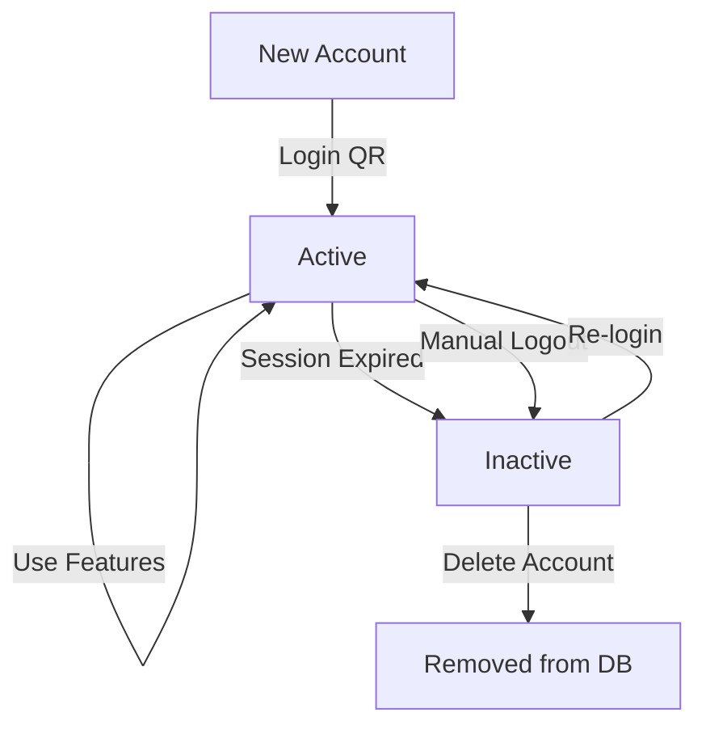

alQuản lý Tài khoản Zalo - Quy trình Hoàn chỉnh

## 📋 Tổng quan

Desktop app quản lý nhiều tài khoản Zalo với full lifecycle: Login → Active → Session Management → Logout

---

## 🔐 1. Flow Đăng nhập (Login)

### Bước 1: Khởi tạo Login
```
User → Click "Thêm tài khoản"
  ↓
Frontend → POST /local/login { accountId }
  ↓
Backend → ZaloClient.login(accountId)
  ↓
Check existing credentials?
  ├─ YES → Try restore session
  │   ├─ SUCCESS → Return user info (restored: true)
  │   └─ FAIL → Continue to QR login
  └─ NO → Generate QR code
```

**File:** [zalo-client.ts:183-260](desktop-app/worker/zalo-client.ts#L183-L260)

**Code:**
```typescript
async login(accountId: number): Promise<LoginResult> {
  // Try restore existing session
  const existingCredentials = await this.loadCredentials(accountId);

  if (existingCredentials) {
    try {
      const api = await zalo.login(existingCredentials);
      const userInfo = await api.fetchAccountInfo();

      this.apiInstances.set(accountId, api);

      return {
        success: true,
        data: { ...userInfo, restored: true }
      };
    } catch (error) {
      // Session expired, continue to QR login
    }
  }

  // Generate QR code for new login
  const qrCode = await generateQRCode();

  return {
    success: true,
    qrCode: qrCode
  };
}
```

---

### Bước 2: QR Code Scan
```
User → Scan QR code with mobile Zalo app
  ↓
Mobile Zalo → Authenticate
  ↓
Frontend → Poll /local/check-login
```

---

### Bước 3: Complete Login
```
Frontend → POST /local/check-login { accountId }
  ↓
Backend → zaloClient.completeLogin(accountId)
  ↓
Get credentials (cookie, imei, userAgent)
  ↓
Save credentials to file (./data/sessions/{accountId}.json)
  ↓
Store API instance in memory
  ↓
Get user info (zaloId, displayName, avatar)
  ↓
Check for duplicate zaloId in DB
  ├─ DUPLICATE → Merge accounts
  │   ├─ Use existing accountId
  │   ├─ Move credentials
  │   ├─ Update DB
  │   └─ Return { merged: true, accountId: existingId }
  └─ NEW → Save to DB
      ├─ INSERT account with status='active'
      └─ Return { success: true }
```

**File:** [zalo-client.ts:660-708](desktop-app/worker/zalo-client.ts#L660-L708)

**Critical Fix Applied:**
```typescript
// ❌ OLD (BUG): Saved wrong format
const zaloSession: ZaloSession = {
  cookies: cookies, // STRING format
  imei: session.api.getImei(),
  userAgent: session.api.getUserAgent(),
};
await this.saveSession(accountId, zaloSession);

// ✅ NEW (FIXED): Save correct format
const credentials: Credentials = {
  cookie: session.api.getCookies(), // ARRAY format
  imei: session.api.getImei(),
  userAgent: session.api.getUserAgent(),
  language: 'vi',
};
await this.saveCredentials(accountId, credentials);
```

---

## 📊 2. Account Status Management

### Status Lifecycle
```
NEW LOGIN → 'active'
  ↓
SESSION VALID → 'active'
  ↓
SESSION EXPIRED → 'inactive' (auto-detected)
  ↓
USER LOGOUT → 'inactive' (manual)
```

### Database Schema
```sql
CREATE TABLE zalo_accounts (
  accountId INTEGER PRIMARY KEY,
  zaloId TEXT UNIQUE,
  displayName TEXT,
  avatar TEXT,
  phoneNumber TEXT,
  status TEXT DEFAULT 'inactive',  -- 'active' | 'inactive'
  lastLoginAt TEXT,
  createdAt TEXT,
  updatedAt TEXT
);
```

**File:** [local-db.ts:40-50](desktop-app/worker/local-db.ts#L40-L50)

---

### Update Status Methods

**1. Set Active (on successful login):**
```typescript
db.upsertAccount({
  accountId: accountId,
  zaloId: result.data.zaloId,
  displayName: result.data.displayName,
  avatar: result.data.avatar,
  status: 'active',  // ← Set active
  lastLoginAt: new Date().toISOString(),
});
```

**2. Set Inactive (on session expired):**
```typescript
// In zalo-client.ts getAPI()
catch (error) {
  this.db.updateAccountStatus(accountId, 'inactive');
  throw new Error('Session expired. Please login again.');
}
```

**File:** [zalo-client.ts:167-174](desktop-app/worker/zalo-client.ts#L167-L174)

**3. Set Inactive (on manual logout):**
```typescript
// In zalo-client.ts logout()
if (this.db) {
  this.db.updateAccountStatus(accountId, 'inactive');
}
```

**File:** [zalo-client.ts:943-945](desktop-app/worker/zalo-client.ts#L943-L945)

---

## 🔄 3. Session Validation & Recovery

### Automatic Session Validation

**When:** Mỗi khi gọi `getAPI(accountId)`

**Process:**
```
1. Check cached API instance exists?
   ├─ YES → Verify still valid (call api.getOwnId())
   │   ├─ SUCCESS → Return cached instance
   │   └─ FAIL → Clear cache, continue to step 2
   └─ NO → Continue to step 2

2. Load credentials from file
   ├─ NOT FOUND → Error: "No session, please login"
   └─ FOUND → Continue to step 3

3. Validate credentials format
   ├─ Invalid (no cookie array) → Error: "Session expired"
   └─ Valid → Continue to step 4

4. Create new API instance from credentials
   ├─ SUCCESS → Verify with api.getOwnId()
   │   ├─ SUCCESS → Cache instance, return
   │   └─ FAIL → Update status='inactive', Error
   └─ FAIL → Update status='inactive', Error
```

**File:** [zalo-client.ts:128-175](desktop-app/worker/zalo-client.ts#L128-L175)

**Implementation:**
```typescript
async getAPI(accountId: number): Promise<any> {
  // 1. Check cached instance
  if (this.apiInstances.has(accountId)) {
    const api = this.apiInstances.get(accountId);
    try {
      await api.getOwnId();  // Verify still valid
      return api;
    } catch (error) {
      console.warn('Cached instance invalid, reloading...');
      this.apiInstances.delete(accountId);
    }
  }

  // 2. Load credentials
  const credentials = await this.loadCredentials(accountId);
  if (!credentials) {
    throw new Error('No session found. Please login first.');
  }

  // 3. Validate format
  if (!credentials.cookie || !Array.isArray(credentials.cookie) || credentials.cookie.length === 0) {
    throw new Error('Session expired or invalid. Please login again.');
  }

  // 4. Create API instance
  try {
    const api = new ZCA.API(credentials.cookie, credentials.imei, credentials.userAgent);
    await api.getOwnId();  // Verify session valid

    this.apiInstances.set(accountId, api);
    return api;
  } catch (error) {
    // Update status to inactive
    this.db.updateAccountStatus(accountId, 'inactive');
    throw new Error('Session expired. Please login again.');
  }
}
```

---

## 🚪 4. Logout Flow

### Manual Logout

**User Action:**
```
User → Click "Đăng xuất" button on account card
  ↓
Show confirmation dialog
  ↓
User confirms
  ↓
Frontend → POST /local/logout { accountId }
  ↓
Backend → zaloClient.logout(accountId)
```

**Cleanup Process:**
```
1. Clear memory
   ├─ Remove from apiInstances Map
   └─ Remove from loginSessions Map

2. Delete session file
   └─ Delete ./data/sessions/{accountId}.json

3. Update database
   └─ UPDATE zalo_accounts SET status='inactive' WHERE accountId=?

4. Frontend refresh
   ├─ Reload accounts list (only shows active)
   └─ Clear selectedAccountId if logged out
```

**File:** [zalo-client.ts:926-948](desktop-app/worker/zalo-client.ts#L926-L948)

**Implementation:**
```typescript
async logout(accountId: number): Promise<void> {
  console.log(`🚪 Logging out account ${accountId}...`);

  // 1. Remove from memory
  this.apiInstances.delete(accountId);
  this.loginSessions.delete(accountId);

  // 2. Delete session file
  try {
    const filePath = this.getSessionFilePath(accountId);
    await fs.unlink(filePath);
    console.log(`✅ Session file deleted`);
  } catch (error) {
    console.warn(`⚠️  Session file not found`);
  }

  // 3. Update database
  if (this.db) {
    this.db.updateAccountStatus(accountId, 'inactive');
  }

  console.log(`✅ Account logged out successfully`);
}
```

---

## 🎨 5. UI Account Management

### Account List Display

**Endpoint:** `GET /local/accounts`

**Filter:** Chỉ trả về accounts có `status='active'`

**File:** [api-server.ts:392-412](desktop-app/worker/api-server.ts#L392-L412)

**Implementation:**
```typescript
app.get('/local/accounts', (req, res) => {
  const accounts = db.getAllAccounts();

  // ✅ CRITICAL: Filter only active accounts
  const transformedAccounts = accounts
    .filter((acc: any) => acc.status === 'active')
    .map((acc: any) => ({
      id: acc.accountId,
      displayName: acc.displayName || 'Zalo Account',
      avatar: acc.avatar,
      phoneNumber: acc.phoneNumber || '',
      userId: acc.zaloId || String(acc.accountId),
      status: acc.status,
    }));

  res.json(transformedAccounts);
});
```

**Before Fix:**
```javascript
// ❌ BUG: Returned ALL accounts (active + inactive)
const accounts = db.getAllAccounts();
res.json(accounts.map(transform));
```

**After Fix:**
```javascript
// ✅ CORRECT: Only active accounts
const accounts = db.getAllAccounts()
  .filter(acc => acc.status === 'active');
res.json(accounts.map(transform));
```

---

### Account Card UI

**File:** [Dashboard.tsx:148-186](desktop-app/renderer/src/pages/Dashboard.tsx#L148-L186)

```tsx
<Paper>
  {/* Account Info (clickable to select) */}
  <Box onClick={() => setSelectedAccountId(account.id)}>
    <Avatar src={account.avatar}>
      {account.displayName[0]}
    </Avatar>
    <Typography>{account.displayName}</Typography>
    <Typography variant="caption">
      {account.phoneNumber || account.userId}
    </Typography>
    <Chip label="Đang hoạt động" color="success" size="small" />
  </Box>

  {/* Logout Button */}
  <Button
    variant="outlined"
    color="error"
    startIcon={<Logout />}
    onClick={(e) => {
      e.stopPropagation();  // Don't trigger card selection
      handleLogout(account.id);
    }}
  >
    Đăng xuất
  </Button>
</Paper>
```

---

## 🔑 6. Credentials Format

### Old Format (ZaloSession) - DEPRECATED
```typescript
interface ZaloSession {
  cookies: string;     // ❌ STRING - Causes "Cookie is not available" error
  imei: string;
  userAgent: string;
}
```

### New Format (Credentials) - CURRENT
```typescript
interface Credentials {
  cookie: any[];       // ✅ ARRAY - Correct format for ZCA.API
  imei: string;
  userAgent: string;
  language?: string;
}
```

### ZCA.API Constructor
```typescript
// Requires cookie as ARRAY, not string
new ZCA.API(
  cookie: any[],        // ← Must be array!
  imei: string,
  userAgent: string
)
```

---

## 📂 7. File Structure

### Session Files Location
```
./data/sessions/
  ├── {accountId}.json        # Credentials file
  └── zalo_{accountId}_qr.png # QR code (temporary)
```

### Credentials File Content
```json
{
  "cookie": [
    { "name": "...", "value": "...", "domain": "..." },
    { "name": "...", "value": "...", "domain": "..." }
  ],
  "imei": "abc-123-def-456",
  "userAgent": "Mozilla/5.0 ...",
  "language": "vi"
}
```

---

## 🐛 8. Common Issues & Fixes

### Issue 1: "Cookie is not available"

**Symptom:**
```
Error: Cookie is not available
  at new Listener (zca-js/apis/listen.cjs:36:19)
```

**Root Cause:** Saving session with old format (cookies: string)

**Fix:** Save with new format (cookie: any[])

**File:** [zalo-client.ts:678-687](desktop-app/worker/zalo-client.ts#L678-L687)

---

### Issue 2: Logged out accounts still showing

**Symptom:** Accounts với status='inactive' vẫn hiển thị trong list

**Root Cause:** Endpoint /local/accounts không filter

**Fix:** Filter chỉ lấy active accounts

**File:** [api-server.ts:397-398](desktop-app/worker/api-server.ts#L397-L398)

---

### Issue 3: Session not restored after restart

**Symptom:** Phải login lại mỗi khi restart app

**Root Cause:**
1. Credentials file format sai
2. API instance không được cache

**Fix:**
1. Đảm bảo save credentials đúng format
2. Implement getAPI() với cache validation

---

### Issue 4: Duplicate accounts

**Symptom:** Cùng một Zalo account tạo nhiều entries

**Root Cause:** Không check zaloId trùng lặp

**Fix:** Implement merge logic trong /local/check-login

**File:** [api-server.ts:95-130](desktop-app/worker/api-server.ts#L95-L130)

---

## 📊 9. Status Transitions



### State Matrix

| Current State | Action | New State | DB Status | UI Display |
|--------------|--------|-----------|-----------|------------|
| Not exists | Login | Active | active | Visible |
| Active | Use app | Active | active | Visible |
| Active | Session expire | Inactive | inactive | Hidden |
| Active | Manual logout | Inactive | inactive | Hidden |
| Inactive | Re-login | Active | active | Visible |

---

## 🧪 10. Testing Checklist

### Login Flow
- [ ] Login với QR code mới
- [ ] Restore session khi credentials hợp lệ
- [ ] Handle session expired gracefully
- [ ] Detect duplicate zaloId và merge
- [ ] Update DB status = 'active' sau login

### Session Management
- [ ] API instance được cache đúng
- [ ] Validate session trước mỗi operation
- [ ] Auto-set status='inactive' khi expired
- [ ] Clear cache khi invalid

### Logout Flow
- [ ] Confirmation dialog xuất hiện
- [ ] Session file bị xóa
- [ ] API instance bị clear
- [ ] DB status = 'inactive'
- [ ] Account biến mất khỏi list
- [ ] Selected account được clear nếu logout account đó

### UI Display
- [ ] Chỉ hiển thị accounts với status='active'
- [ ] Logout button hoạt động đúng
- [ ] Account card update realtime
- [ ] Status chip hiển thị đúng

---

## 🚀 11. Future Improvements

### Priority 1: Auto Session Refresh
```typescript
// Periodically refresh session before expiry
setInterval(async () => {
  for (const [accountId, api] of this.apiInstances) {
    try {
      await api.getOwnId(); // Verify still valid
    } catch (error) {
      // Session expired, notify user
      this.db.updateAccountStatus(accountId, 'inactive');
      this.emit('session-expired', accountId);
    }
  }
}, 5 * 60 * 1000); // Every 5 minutes
```

### Priority 2: Multi-Device Session Detection
- Detect if same account logged in from another device
- Show warning to user
- Allow force logout other sessions

### Priority 3: Session History
- Track login/logout history
- Store last active timestamp
- Show last used date in UI

### Priority 4: Bulk Operations
- Logout all accounts
- Re-validate all sessions
- Export/import accounts

---

## 📝 12. Files Modified

### Backend (Worker)
- ✅ `desktop-app/worker/zalo-client.ts`
  - Fixed completeLogin() to save Credentials format
  - Improved getAPI() with validation
  - Enhanced logout() with DB update

- ✅ `desktop-app/worker/api-server.ts`
  - Fixed /local/accounts to filter active only
  - Added logging to /local/find-user

- ✅ `desktop-app/worker/local-db.ts`
  - Added updateAccountStatus() method

### Frontend (Renderer)
- ✅ `desktop-app/renderer/src/api/localApi.ts`
  - Added logoutZalo() function

- ✅ `desktop-app/renderer/src/pages/Dashboard.tsx`
  - Added handleLogout() with confirmation
  - Added logout button to account cards

---

## 🎯 Summary

### Key Points
1. ✅ **Credentials Format**: Must use `cookie: any[]` (not `cookies: string`)
2. ✅ **Status Management**: Active/Inactive tracked in DB
3. ✅ **Session Validation**: Auto-detect expired sessions
4. ✅ **Account List**: Only show active accounts
5. ✅ **Logout Cleanup**: Full cleanup (memory + file + DB)

### Critical Bugs Fixed
1. ✅ completeLogin() saving wrong format → Fixed to Credentials
2. ✅ /local/accounts showing all accounts → Fixed to filter active only
3. ✅ getAPI() not validating credentials → Added validation
4. ✅ Logout not updating DB → Added updateAccountStatus()

---

**Date:** 2025-11-13
**Version:** 2.3.0 (Account Management Overhaul)
**Status:** ✅ Production Ready
