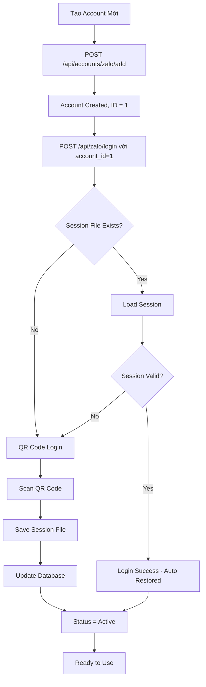

# Quản Lý Nhiều Tài Khoản Zalo

Hướng dẫn chi tiết về cách hệ thống akaBiz Clone quản lý đăng nhập và sử dụng nhiều tài khoản Zalo đồng thời.

## 📋 Mục Lục

- [Tổng Quan Kiến Trúc](#tổng-quan-kiến-trúc)
- [Cách Hoạt Động](#cách-hoạt-động)
- [Database Structure](#database-structure)
- [Session Management](#session-management)
- [API Usage](#api-usage)
- [Quy Trình Đăng Nhập](#quy-trình-đăng-nhập)
- [Best Practices](#best-practices)
- [Troubleshooting](#troubleshooting)

---

## Tổng Quan Kiến Trúc

### Hệ thống Multi-Account

akaBiz Clone hỗ trợ quản lý **KHÔNG GIỚI HẠN** số lượng tài khoản Zalo đồng thời. Mỗi tài khoản:

✅ **Có session riêng biệt** - Không xung đột với nhau
✅ **Lưu trữ độc lập** - Session data, cookies, IMEI riêng
✅ **Hoạt động song song** - Có thể sử dụng nhiều account cùng lúc
✅ **Tự động restore** - Session được lưu và khôi phục tự động

### Kiến Trúc 3 Tầng

```
┌─────────────────────────────────────────────────────────────┐
│                    Application Layer                        │
│  - Campaigns (chọn account nào để gửi)                     │
│  - Templates (thuộc về account nào)                         │
│  - Contacts/Groups (của account nào)                        │
└────────────────────┬────────────────────────────────────────┘
                     │
┌────────────────────▼────────────────────────────────────────┐
│                  Service Layer                               │
│  - ZaloAPIService (nhận account_id)                         │
│  - Gọi Node.js bridge với account_id                        │
└────────────────────┬────────────────────────────────────────┘
                     │
┌────────────────────▼────────────────────────────────────────┐
│                 Storage Layer                                │
│  - Database: zalo_accounts table (thông tin account)        │
│  - Files: ./data/sessions/{account_id}.json (session data)  │
└─────────────────────────────────────────────────────────────┘
```

---

## Cách Hoạt Động

### 1. Lưu Trữ Account Information

Mỗi tài khoản Zalo được lưu trong database với:

```python
class ZaloAccount(Base):
    id = Column(Integer, primary_key=True)           # ID nội bộ
    user_id = Column(Integer, ForeignKey("users.id")) # User sở hữu
    phone_number = Column(String(20), unique=True)    # Số điện thoại
    display_name = Column(String(255))                # Tên hiển thị
    zalo_id = Column(String(255), unique=True)        # Zalo user ID

    # Session Data
    session_data = Column(JSON)      # cookie, imei, userAgent
    browser_profile = Column(JSON)   # Browser settings

    # Status
    status = Column(String(50))      # active, inactive, banned, error
    last_login_at = Column(DateTime)
    last_activity_at = Column(DateTime)
```

### 2. Session Files

Mỗi account có 1 file JSON riêng:

**File Location**: `./data/sessions/{account_id}.json`

**Nội dung**:
```json
{
  "cookie": "zalo_session_cookie_here",
  "imei": "unique_imei_for_this_account",
  "userAgent": "Mozilla/5.0...",
  "secretKey": "encryption_key"
}
```

### 3. API Request Flow

Khi gửi tin nhắn từ account #1:

```
1. Frontend/API Call
   POST /api/zalo/send-message
   {
     "account_id": 1,          ← Chỉ định account nào
     "user_id": "target_user",
     "message": "Hello"
   }

2. Python Service Layer
   zalo_api_service.send_message(
     account_id="1",            ← Truyền account_id
     user_id="...",
     message="..."
   )

3. Node.js Bridge
   node zalo_bridge/index.js sendMessage 1 target_user "Hello"
                                         ↑
                                    account_id

4. Session Loading
   - Đọc file: ./data/sessions/1.json
   - Load cookie, imei, userAgent
   - Khởi tạo Zalo client với session này

5. Execute Action
   - Gửi tin nhắn qua zca-js API
   - Sử dụng session của account #1
```

---

## Database Structure

### Bảng `zalo_accounts`

| Cột | Kiểu | Mô tả |
|-----|------|-------|
| `id` | Integer | Primary key (dùng làm account_id) |
| `user_id` | Integer | User sở hữu account này |
| `phone_number` | String | Số điện thoại (unique) |
| `display_name` | String | Tên hiển thị |
| `avatar_url` | String | URL avatar |
| `zalo_id` | String | Zalo user ID (unique) |
| `session_data` | JSON | Session info (cookie, imei, etc) |
| `browser_profile` | JSON | Browser settings |
| `status` | String | active/inactive/banned/error |
| `last_login_at` | DateTime | Lần đăng nhập cuối |
| `last_activity_at` | DateTime | Hoạt động cuối |

### Relationships

Mỗi `ZaloAccount` có nhiều:
- **Contacts** - Danh bạ của account này
- **Groups** - Các group đã join
- **Campaigns** - Campaigns chạy từ account này
- **Templates** - Message templates của account
- **AutoReply Rules** - Quy tắc tự động trả lời

```python
# Ví dụ: Lấy tất cả campaigns của account #1
account = db.query(ZaloAccount).filter(ZaloAccount.id == 1).first()
campaigns = account.campaigns  # Tất cả campaigns của account này
```

---

## Session Management

### Quy Trình Session

#### Đăng Nhập Lần Đầu

```javascript
// zalo-client.js
async login(accountId) {
    // 1. Kiểm tra file session
    const sessionFile = `./data/sessions/${accountId}.json`;

    if (!fs.existsSync(sessionFile)) {
        // 2. Không có session → Đăng nhập QR
        this.zalo = new Zalo();
        this.api = await this.zalo.loginQR();  // Hiển thị QR code

        // 3. Lưu session
        const sessionData = {
            cookie: await this.api.getCookie(),
            imei: this.api.getContext().imei,
            userAgent: this.api.getContext().userAgent,
            secretKey: this.api.getContext().secretKey
        };

        fs.writeFileSync(sessionFile, JSON.stringify(sessionData));

        return { success: true, requiresQR: true };
    }
}
```

#### Đăng Nhập Lần Sau (Auto-Restore)

```javascript
async login(accountId) {
    const sessionFile = `./data/sessions/${accountId}.json`;

    if (fs.existsSync(sessionFile)) {
        // 1. Đọc session đã lưu
        const sessionData = JSON.parse(fs.readFileSync(sessionFile));

        // 2. Khôi phục session
        this.zalo = new Zalo({
            cookie: sessionData.cookie,
            imei: sessionData.imei,
            userAgent: sessionData.userAgent
        });

        // 3. Verify session còn hợp lệ
        try {
            const info = await this.zalo.getOwnId();
            return { success: true, requiresQR: false };
        } catch (error) {
            // Session hết hạn → Cần login QR lại
            return { success: false, requiresQR: true };
        }
    }
}
```

### Session Lifecycle

```
┌─────────────┐
│ First Login │ → QR Code Login → Save Session → Active
└─────────────┘

┌──────────────┐
│ Next Login   │ → Load Session → Verify → Active
└──────────────┘

┌──────────────┐
│ Session      │ → Detect Expired → QR Login → Update Session
│ Expired      │
└──────────────┘
```

---

## API Usage

### Tạo Account Mới

```bash
POST /api/accounts/zalo/add
Content-Type: application/json

{
  "phone_number": "0123456789",
  "display_name": "Account Marketing"
}
```

**Response**:
```json
{
  "id": 1,
  "phone_number": "0123456789",
  "display_name": "Account Marketing",
  "status": "inactive",
  "requires_login": true
}
```

### Đăng Nhập Account

```bash
POST /api/zalo/login
Content-Type: application/json

{
  "account_id": 1
}
```

**Response (Cần QR)**:
```json
{
  "success": true,
  "requiresQR": true,
  "message": "Please scan QR code",
  "qr_code_url": "data:image/png;base64,..."
}
```

**Response (Auto-Restored)**:
```json
{
  "success": true,
  "requiresQR": false,
  "message": "Session restored successfully",
  "data": {
    "id": "123456789",
    "displayName": "Account Marketing"
  }
}
```

### Sử Dụng Account Trong Campaign

```bash
POST /api/campaigns/
Content-Type: application/json

{
  "name": "Campaign 1",
  "account_id": 1,              ← Chọn account để gửi
  "target_type": "groups",
  "target_groups": [1, 2, 3],
  "message_content": "Hello from Account #1"
}
```

### Gửi Message Từ Account Cụ Thể

```bash
POST /api/zalo/send-message
Content-Type: application/json

{
  "account_id": 1,              ← Account #1
  "user_id": "target_zalo_id",
  "message": "Test message"
}
```

### Lấy Danh Sách Accounts

```bash
GET /api/accounts/zalo/
```

**Response**:
```json
[
  {
    "id": 1,
    "phone_number": "0123456789",
    "display_name": "Account Marketing",
    "status": "active",
    "last_login_at": "2024-12-07T10:00:00",
    "campaigns_count": 5
  },
  {
    "id": 2,
    "phone_number": "0987654321",
    "display_name": "Account Support",
    "status": "active",
    "last_login_at": "2024-12-07T09:00:00",
    "campaigns_count": 3
  }
]
```

---

## Quy Trình Đăng Nhập

### Luồng Đầy Đủ



### Chi Tiết Từng Bước

#### Bước 1: Thêm Account Mới

```bash
curl -X POST http://localhost:8000/api/accounts/zalo/add \
  -H "Content-Type: application/json" \
  -d '{
    "phone_number": "0123456789",
    "display_name": "Marketing Account"
  }'
```

#### Bước 2: Đăng Nhập Lần Đầu

```bash
curl -X POST http://localhost:8000/api/zalo/login \
  -H "Content-Type: application/json" \
  -d '{"account_id": 1}'
```

**Kết quả**:
- QR code được tạo
- Scan QR bằng app Zalo trên điện thoại
- Session được lưu vào `./data/sessions/1.json`
- Database cập nhật status = "active"

#### Bước 3: Sử Dụng Account

```bash
# Gửi tin nhắn từ account #1
curl -X POST http://localhost:8000/api/zalo/send-message \
  -H "Content-Type: application/json" \
  -d '{
    "account_id": 1,
    "user_id": "target_user_id",
    "message": "Hello from Account 1"
  }'

# Tạo campaign với account #1
curl -X POST http://localhost:8000/api/campaigns/ \
  -H "Content-Type: application/json" \
  -d '{
    "name": "Campaign 1",
    "account_id": 1,
    "message_content": "Bulk message from Account 1"
  }'
```

---

## Best Practices

### 1. Tổ Chức Accounts

**Theo Mục Đích**:
- Account 1: Marketing campaigns
- Account 2: Customer support
- Account 3: Sales
- Account 4: Testing

**Theo Khu Vực**:
- Account 1: Hà Nội
- Account 2: Hồ Chí Minh
- Account 3: Đà Nẵng

### 2. Naming Convention

```json
{
  "display_name": "[Purpose] - [Region/Team]",
  "examples": [
    "Marketing - HN",
    "Support - Team A",
    "Sales - VIP Customers",
    "Test - Development"
  ]
}
```

### 3. Session Management

**Backup Sessions**:
```bash
# Backup tất cả sessions
cp -r ./data/sessions ./data/sessions_backup_$(date +%Y%m%d)
```

**Rotate Sessions**:
```bash
# Login lại định kỳ (30 ngày)
# Cập nhật session mới để tránh expired
```

### 4. Account Status Monitoring

```python
# Check account status
def check_account_health(account_id):
    try:
        result = await zalo_api.get_account_info(account_id)
        if result.get('success'):
            # Update last_activity_at
            account.status = "active"
        else:
            # Session expired
            account.status = "error"
    except Exception as e:
        account.status = "error"
```

### 5. Rate Limiting Per Account

**Tránh Spam**:
- Max 100 messages/hour per account
- Delay 2-5 seconds giữa các tin nhắn
- Rotate accounts cho campaigns lớn

**Example**:
```python
# Campaign 1000 messages → Dùng 5 accounts
# Mỗi account gửi 200 messages
# Tổng thời gian giảm 5 lần
```

---

## Troubleshooting

### Lỗi: "Session expired"

**Nguyên nhân**: Session file hết hạn (thường sau 30-60 ngày)

**Giải pháp**:
```bash
# 1. Login lại
POST /api/zalo/login {"account_id": 1}

# 2. Scan QR code mới
# 3. Session sẽ được cập nhật tự động
```

### Lỗi: "Account is banned"

**Nguyên nhân**: Zalo phát hiện spam hoặc vi phạm

**Giải pháp**:
```bash
# 1. Cập nhật status trong database
UPDATE zalo_accounts SET status = 'banned' WHERE id = 1;

# 2. Thêm account mới thay thế
POST /api/accounts/zalo/add

# 3. Di chuyển campaigns sang account mới
UPDATE zalo_campaigns SET account_id = 2 WHERE account_id = 1;
```

### Lỗi: "Cannot find session file"

**Nguyên nhân**: File session bị xóa hoặc move

**Giải pháp**:
```bash
# 1. Restore từ backup (nếu có)
cp ./data/sessions_backup/1.json ./data/sessions/

# 2. Hoặc login lại
POST /api/zalo/login {"account_id": 1}
```

### Lỗi: "Account already in use"

**Nguyên nhân**: 2 processes đang dùng cùng 1 account

**Giải pháp**:
```bash
# Chỉ chạy 1 instance của backend
# Hoặc sử dụng locking mechanism
```

### Xung Đột Session

**Triệu chứng**: Tin nhắn gửi từ account A nhưng hiển thị từ account B

**Giải pháp**:
```bash
# 1. Clear tất cả sessions
rm -rf ./data/sessions/*

# 2. Login lại từng account
POST /api/zalo/login {"account_id": 1}
POST /api/zalo/login {"account_id": 2}

# 3. Verify bằng cách gửi test message
```

---

## Advanced: Account Pooling

### Rotating Accounts for Large Campaigns

```python
class AccountPool:
    """Quản lý pool accounts để rotate"""

    def __init__(self, account_ids: List[int]):
        self.accounts = account_ids
        self.current_index = 0
        self.usage_count = {}

    def get_next_account(self) -> int:
        """Lấy account tiếp theo (round-robin)"""
        account = self.accounts[self.current_index]
        self.current_index = (self.current_index + 1) % len(self.accounts)

        self.usage_count[account] = self.usage_count.get(account, 0) + 1
        return account

# Usage
pool = AccountPool([1, 2, 3, 4, 5])

for i in range(1000):
    account_id = pool.get_next_account()
    send_message(account_id, recipients[i], message)
```

### Load Balancing

```python
# Phân phối campaign cho nhiều accounts
def distribute_campaign(campaign_id: int, account_ids: List[int]):
    recipients = get_campaign_recipients(campaign_id)

    # Chia đều recipients cho các accounts
    chunk_size = len(recipients) // len(account_ids)

    for i, account_id in enumerate(account_ids):
        start = i * chunk_size
        end = start + chunk_size if i < len(account_ids) - 1 else len(recipients)

        # Tạo sub-campaign cho mỗi account
        create_sub_campaign(
            account_id=account_id,
            recipients=recipients[start:end]
        )
```

---

## Security

### 1. Session File Permissions

```bash
# Bảo mật session files
chmod 600 ./data/sessions/*.json
```

### 2. Database Encryption

```python
# Mã hóa session_data trong database
from cryptography.fernet import Fernet

def encrypt_session_data(data: dict) -> str:
    key = settings.ENCRYPTION_KEY
    f = Fernet(key)
    return f.encrypt(json.dumps(data).encode()).decode()

def decrypt_session_data(encrypted: str) -> dict:
    key = settings.ENCRYPTION_KEY
    f = Fernet(key)
    return json.loads(f.decrypt(encrypted.encode()))
```

### 3. Access Control

```python
# Chỉ cho phép user truy cập accounts của mình
def get_account(account_id: int, current_user: User):
    account = db.query(ZaloAccount).filter(
        ZaloAccount.id == account_id,
        ZaloAccount.user_id == current_user.id  # Security check
    ).first()

    if not account:
        raise HTTPException(403, "Access denied")

    return account
```

---

## Monitoring

### Account Health Dashboard

```python
# API endpoint
@router.get("/api/accounts/health")
def get_accounts_health():
    accounts = db.query(ZaloAccount).all()

    return [
        {
            "id": acc.id,
            "display_name": acc.display_name,
            "status": acc.status,
            "last_activity": acc.last_activity_at,
            "uptime_hours": calculate_uptime(acc),
            "messages_sent_today": count_messages_today(acc.id),
            "campaigns_active": count_active_campaigns(acc.id)
        }
        for acc in accounts
    ]
```

### Alerts

```python
# Cảnh báo khi account có vấn đề
def check_account_alerts():
    accounts = db.query(ZaloAccount).all()

    for account in accounts:
        # Session sắp hết hạn (25 ngày)
        if is_session_expiring_soon(account):
            send_alert(f"Account {account.id} session expiring soon")

        # Không hoạt động > 24h
        if is_inactive(account, hours=24):
            send_alert(f"Account {account.id} inactive")

        # Rate limit gần đạt
        if is_near_rate_limit(account):
            send_alert(f"Account {account.id} near rate limit")
```

---

## Kết Luận

Hệ thống akaBiz Clone quản lý multi-account thông qua:

✅ **Database** - Lưu thông tin accounts
✅ **Session Files** - Mỗi account 1 file riêng
✅ **API Parameter** - account_id trong mọi request
✅ **Auto-Restore** - Tự động khôi phục session
✅ **Isolation** - Các accounts hoàn toàn độc lập

Với kiến trúc này, bạn có thể:
- Quản lý không giới hạn accounts
- Chạy campaigns từ nhiều accounts đồng thời
- Rotate accounts để tránh spam detection
- Monitor và maintain từng account riêng biệt

---

**Tài liệu tham khảo**:
- [Database Models](../backend/app/models/zalo_account.py)
- [Zalo API Service](../backend/app/services/zalo_api_service.py)
- [Zalo Client](../zalo_bridge/src/zalo-client.js)
